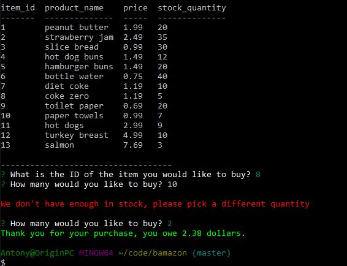
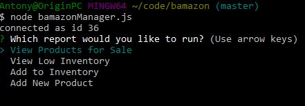
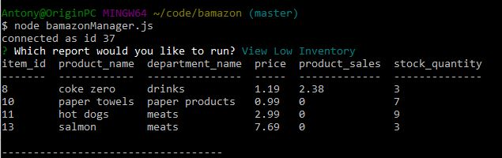
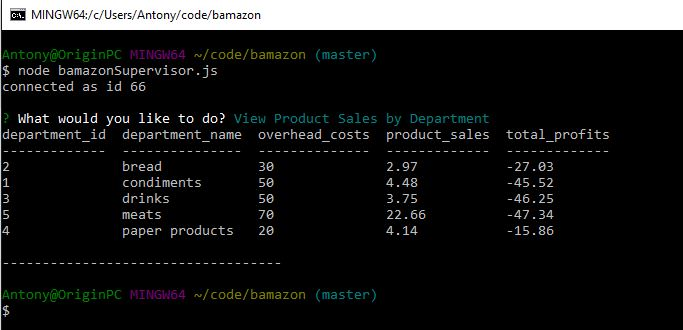

# bamazon
A mysql application for customers ordering product and tracking inventory

This application allows a customer to order products from company called Bamazon.  Upon entering the application, an offer sheet will be displayed allowing the customer to choose a product by the entering its ID and quantity.  If a valid ID is entered and the quantity requested is available in inventory, a sale is completed.

Customer side application is launched via node bamazonCustomer.js.

Here is the manager menu launched via node bamazonManager.js:

Here is the manager's view of products for sale:

Here is the manager's low inventory view:

Here is a [link to custormer interface video](http://f.cl.ly/items/1N2n1x081h432G160b09/Screen%20Recording%202018-04-15%20at%2010.35.14.18%20PM.mp4)

Here is a [link to the Manager view video](http://f.cl.ly/items/3U440N240o2Q0c0t3944/Screen%20Recording%202018-04-15%20at%2010.46.29.66%20PM.mp4)

Here is a snapshot of the bonus Superview report of product sales and profits by department:

Here is a [link to the bonus supervisor view video](http://f.cl.ly/items/3J3x3m2f442b1F1t093P/Screen%20Recording%202018-04-19%20at%2002.57.00.36%20PM.mp4)