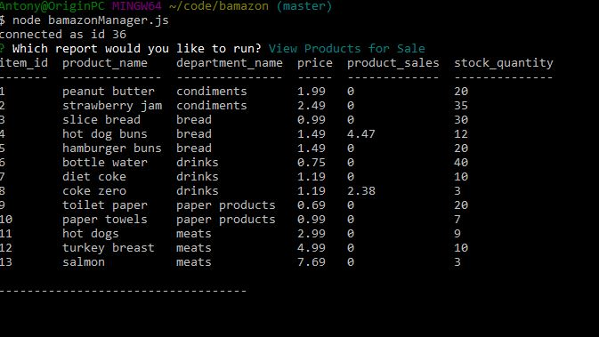

# bamazon
A mysql application for customers ordering product and tracking inventory

This application allows a customer to order products from company called Bamazon.  Upon entering the application, an offer sheet will be displayed allowing the customer to choose a product by the entering its ID and quantity.  If a valid ID is entered and the quantity requested is available in inventory, a sale is completed.

Customer side application is launched via node bamazonCustomer.js.

Here is the manager menu launched via node bamazonManager.js:

Here is the manager's view of products for sale:

Here is the manager's low inventory view:

Here is a video of custormer interface

Here is a video fo the Manager view

